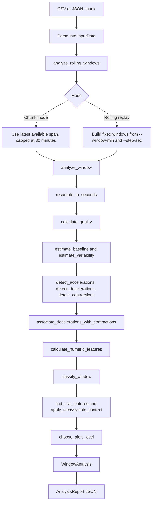

# FHR Monitor Analyzer Architecture

This document explains the current code structure, module boundaries, and analysis flow. The design goal is to keep clinical interpretation logic in one reusable Rust core, with thin wrappers for the CLI, Python package, and future HTTP service.

## Current Module Structure

```text
src/lib.rs                    Public Rust library facade.
src/main.rs                   CLI wrapper for local CSV replay and JSON/text output.
src/python.rs                 PyO3 native extension functions for Python.
src/fhr_core/mod.rs           Public exports for the reusable FHR core.
src/fhr_core/model.rs         Domain structs, enums, analysis config, and report types.
src/fhr_core/csv_input.rs     CSV import from a file path or in-memory string.
src/fhr_core/json_input.rs    JSON request import for docs/data_contract.md requests.
src/fhr_core/time.rs          Timestamp parsing and duration helpers.
src/fhr_core/analysis.rs      Signal cleanup, feature extraction, classification,
                              alert selection, and JSON formatting.
python/fhr_monitor_analyzer/  Python package wrapper and plotting API.
docs/                         Contracts, rules, architecture, and product notes.
scripts/                      Local plotting and inspection helpers.
.github/workflows/            CI and Python publishing workflows.
```

The important boundary is `src/fhr_core`. Anything that decides what the tracing means should live there. Wrappers should parse inputs, call the core, and format or transport the result.

## Public Entry Points

### Rust Library

The reusable Rust API is exported from `src/lib.rs`:

```rust
read_monitor_csv(path) -> Result<InputData, String>
read_monitor_csv_str(csv_text) -> Result<InputData, String>
read_analysis_request_json(json_text) -> Result<(InputData, AnalysisConfig), String>
analyze_rolling_windows(&InputData, AnalysisConfig) -> AnalysisReport
report_as_json(&AnalysisReport) -> String
```

New wrappers should use these APIs instead of reimplementing parsing or clinical rules.

### CLI

The CLI entry point is `src/main.rs`.

```bash
cargo run --bin fhr-monitor-analyzer-cli -- /path/to/monitor.csv --channel HR1 --json
```

The CLI does three things:

1. Parse command-line flags into `AnalysisConfig`.
2. Load CSV input through `read_monitor_csv`.
3. Call `analyze_rolling_windows` and print either JSON or a text summary.

The CLI should stay thin. It should not contain clinical rules.

### Python Package

The Python package is `fhr-monitor-analyzer`, imported as `fhr_monitor_analyzer`. The analysis functions return JSON strings.

```python
analyze_json(request_json: str) -> str
analyze_csv(csv_text: str, ...) -> str
analyze_json_file(path) -> str
analyze_csv_file(path, ...) -> str
plot_csv(csv_text, output, ...) -> str
plot_csv_file(path, output=None, ...) -> str
```

The native bridge is in `src/python.rs`; the importable Python wrapper and plotting functions are under `python/fhr_monitor_analyzer`.

### Future Service

The intended service entry point is:

```http
POST /v1/analyze
Content-Type: application/json
```

The request shape is documented in `docs/data_contract.md`. The service should parse that JSON into `InputData` and `AnalysisConfig`, call the same Rust core, and return the same JSON report shape.

## Main Analysis Flow



## Key Functions

### Input Parsing

`read_monitor_csv` and `read_monitor_csv_str` read the current monitor CSV export format from either a file path or an in-memory string.

`read_analysis_request_json` reads the future service request contract from JSON.

Responsibilities:

- Require timestamps.
- Accept optional `HR1`, `HR2`, `HR3`, `HRM`, and `TOCO` channels.
- Parse timestamps into milliseconds.
- Preserve out-of-order and duplicate timestamp metadata.
- Sort samples before analysis.
- Convert request options and metadata into `AnalysisConfig`.

### Window Selection

`analyze_rolling_windows` supports two modes:

- Chunk mode: production-style pushes. The caller sends the recent data it has. The engine infers the duration and analyzes the latest span, capped at 30 minutes.
- Rolling replay mode: offline tuning. The caller supplies `window_minutes` and `step_seconds`, and the engine produces multiple windows.

### Per-Window Analysis

`analyze_window` is the central orchestration function.

It performs these steps in order:

1. Select raw samples inside the window.
2. Resample the data into one-second buckets.
3. Calculate data-quality metadata.
4. Estimate baseline and variability from the current 10-minute segment.
5. Detect accelerations, decelerations, and contractions in the recent evaluation context.
6. Associate gradual decelerations with TOCO contractions when possible.
7. Calculate numeric features for downstream systems.
8. Classify the tracing as Category I, II, III, or unclassified.
9. Identify high-risk and protective features.
10. Add limitations when the chunk is too short or signal is incomplete.
11. Choose the final alert level.

The ordering is intentional. Data-quality and measurement failures should become explicit limitations instead of hidden assumptions.

### Feature Extraction

The core feature functions in `analysis.rs` are:

- `resample_to_seconds`: averages irregular raw samples into one-second buckets.
- `calculate_quality`: reports usable fetal, maternal, and TOCO ratios, plus suspected fetal/maternal capture.
- `estimate_baseline`: computes a 10-minute trimmed mean and rounds to the nearest 5 bpm.
- `estimate_variability`: estimates variability from per-minute p95-p05 ranges near baseline.
- `detect_accelerations`: detects accelerations using gestational-age-aware thresholds.
- `detect_decelerations`: detects drops at least 15 bpm below baseline for at least 15 seconds.
- `detect_contractions`: identifies contraction-like TOCO peaks.
- `associate_decelerations_with_contractions`: classifies gradual decelerations as early or late when TOCO timing is clear.
- `calculate_numeric_features`: builds the numeric `features` object returned in every window.

### Classification and Alerting

The interpretation functions in `analysis.rs` are:

- `classify_window`: assigns `category_i`, `category_ii`, `category_iii`, or `unclassified`.
- `find_risk_features`: adds high-risk and protective feature labels.
- `apply_tachysystole_context`: converts tachysystole into alert context.
- `calculate_limitations`: explains what could not be assessed.
- `choose_alert_level`: maps classification, risk features, protection, and quality into `none`, `warning`, `urgent_review`, `critical`, or `data_quality`.

The user-facing rule explanation is maintained separately in `docs/alerting_strategy.md`.

## Data Model

`src/fhr_core/model.rs` contains the main domain types:

- `MonitorSample`: one raw monitor sample.
- `InputData`: sorted monitor samples plus input-quality metadata.
- `AnalysisConfig`: selected fetal channel, rolling-window options, step size, and gestational age.
- `AnalysisReport`: full result for one request.
- `WindowAnalysis`: analysis result for one current-state or replay window.
- `NumericFeatures`: structured numeric fetal, TOCO, and maternal comparison metrics.
- `DataQuality`: signal quality and interpretability metrics.
- `CategoryClassification`: `category_i`, `category_ii`, `category_iii`, or `unclassified`.
- `AlertLevel`: `none`, `warning`, `urgent_review`, `critical`, or `data_quality`.

## Organization Rules

Follow these rules as the project grows:

- Keep all clinical rules and measurements inside `src/fhr_core`.
- Keep wrappers thin. CLI, HTTP, and Python code should parse inputs, call the core, and return the result.
- Do not duplicate rule logic in Python, HTTP handlers, or UI code.
- Prefer typed structs plus `serde` for JSON before adding more hand-written formatting.
- Keep output fields stable and additive. Removing or renaming response fields should be treated as a breaking API change.
- Add fixture tests when changing alert behavior.
- Keep sample data out of git unless the dataset is intentionally curated and approved for sharing.

## Recommended Next Structural Changes

1. Replace the manual response JSON formatter with `serde` serialization.
2. Add an HTTP service wrapper, likely with `axum`.
3. Add response schema documentation after `serde` serialization is in place.
4. Add episode-level state and alert deduplication above the stateless core.

